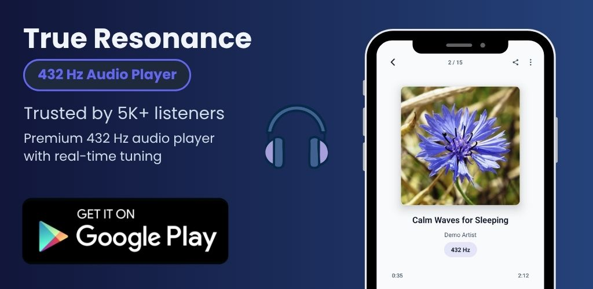

<!-- Banner -->

  

<h2>Hey there 👋</h2>

  My name is <b>Rafa</b>, and I'm a fullstack developer focused on web, mobile, and AI projects.

- 🔭 Developed **[True Resonance](https://trueresonance.rafacmur.com/)**, a 432 Hz audio tuner trusted by **5K+ users**.
- 🔭 Working on **[MoneyBoard](https://moneyboard.seltore.com)** (finance tracker).
- 🌱 Learning **Backend technologies**, **Privacy**, and **Sales** to connect tech and business.
- ⚡ Fun fact: I use an **e-ink phone** to stay focused.

<h3 align="start">🚀 Featured Projects</h3>

  

  <b>True Resonance</b> is a modern 432 Hz audio player with real-time tuning, designed for calm, focused listening. 
  Trusted by <b>5K+ listeners</b>.

  

<table align="center" width="100%">
  <!-- Row 1: logos -->
  <tr>
    <td align="center" width="50%">
      
    </td>
    <td align="center" width="50%">
      
    </td>
  </tr>

  <!-- Row 2: titles -->
  <tr>
    <td align="center"><h4><b>MoneyBoard</b></h4></td>
    <td align="center"><h4><b>True Resonance</b></h4></td>
  </tr>

  <!-- Row 3: descriptions -->
  <tr>
    <td align="center">
      
Cross-platform finance tracker built with Tauri, React, and TypeScript.

    </td>
    <td align="center">
      
Chrome extension that tunes online audio to 432 Hz in real time.

    </td>
  </tr>
</table>

 

  

<h3 align="center">Tech Stack</h3>

  

  

 

<h3 align="center">Connect with Me</h3>

  
  
  

<!--
**RafaCMur/RafaCMur** is a ✨ _special_ ✨ repository because its `README.md` (this file) appears on your GitHub profile.

Here are some ideas to get you started:

- 🔭 I’m currently working on ...
- 🌱 I’m currently learning ...
- 👯 I’m looking to collaborate on ...
- 🤔 I’m looking for help with ...
- 💬 Ask me about ...
- 📫 How to reach me: ...
- 😄 Pronouns: ...
- ⚡ Fun fact: ...
-->
